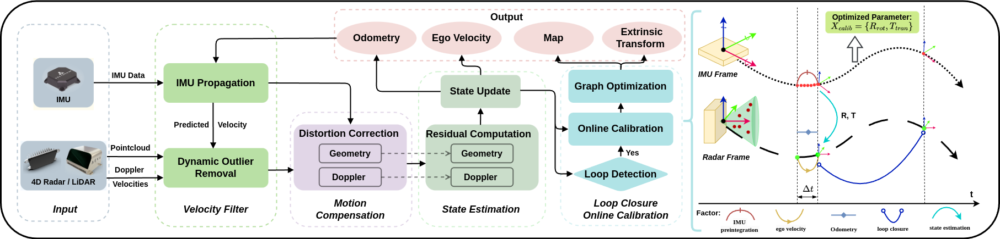
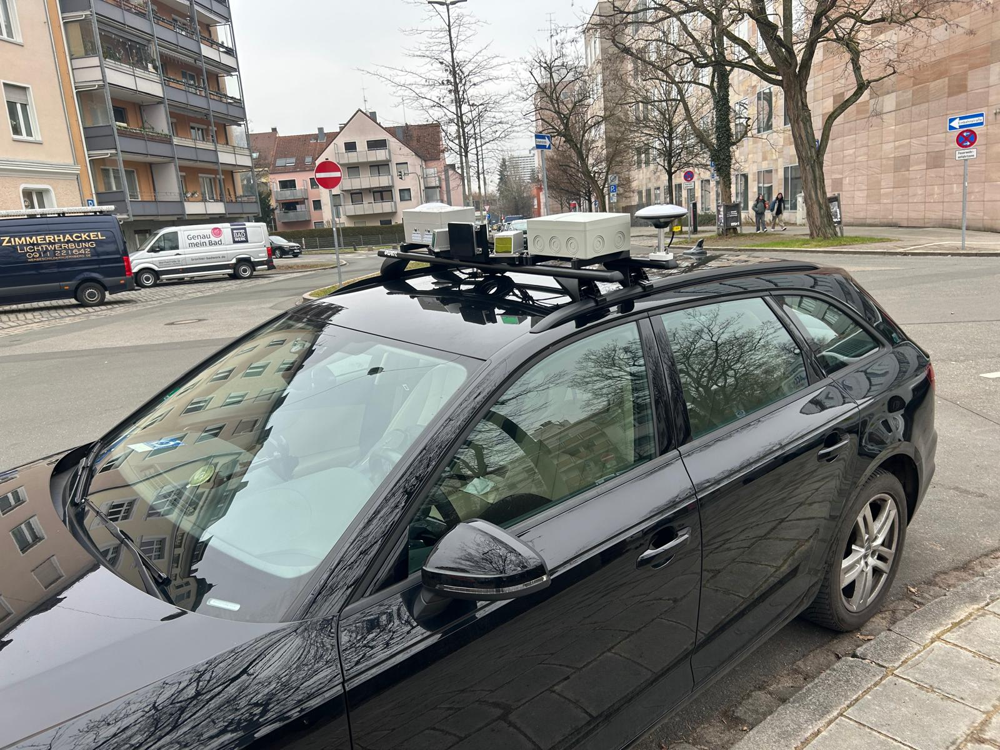
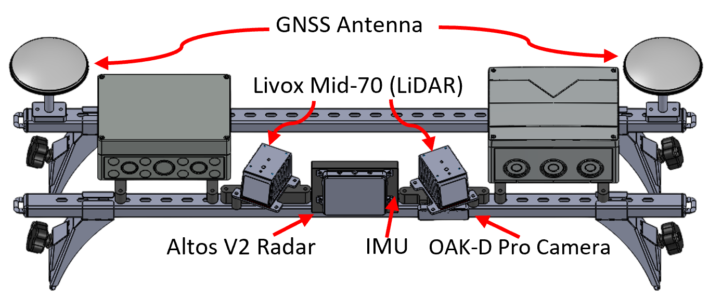

    <h1>Doppler-SLAM</h1>

**Doppler-SLAM** is a unified SLAM approach that combines a tightly-coupled front-end with a graph optimization back-end, seamlessly integrating IMU, 4D radar or FMCW LiDAR, and Doppler velocity measurements.

*Note: Our paper is currently under review. The source code and dataset will be made available upon publication.*

    

## Demo

  <table>
    <tr>
      <td>
        
        
<em>Doppler SLAM with FMCW LiDAR on Sequence "Sports Complex" from HeRCULES dataset.</em>

      </td>
    </tr>
    <tr>
      <td>
        
        
<em>Doppler SLAM with 4D Radar on Sequence ""WoehrSee" from our IMADAR dataset.</em>

      </td>
    </tr>
        <tr>
          <td>
            
            
<em>Results of Doppler SLAM with 4D Radar on Sequence ""WoehrSee" from our IMADAR dataset.</em>

          </td>
        </tr>
        <tr>
      <td>
        
        
<em>Doppler SLAM with 4D Radar on Sequence ""N4" from our IMADAR dataset (vehicle speeds up to 110 km/h).</em>

      </td>
    </tr>
  </table>

## Overview

Pipeline of Doppler-SLAM consists of four main modules: velocity filter, motion compensation, state estimation, and loop closure with graph optimization. The graph on the right illustrates the workflow of online extrinsic calibration between the IMU and either radar or LiDAR using graph optimization. In this approach, we combine the IMU pre-integration factor, odometry factor, and ego velocity factor to construct a factor graph. Once a loop closure factor is detected, additional optimization refines the extrinsic transformation.

    

## Usage

todo

## Dataset

todo
### Hardware Setup

 
    

    

### Sensor Specification

| Sensor | Model | Specifications |
|--------|-------|----------------|
| 4D Radar | Altos V2 | Range: 0.2-200m, Azimuth Resolution: 1.38°, Range Resolution: 0.35m, Speed Resolution: 0.2m/s, Up to 6000 points per frame @ 15fps |
| LiDAR | 2 × Livox Mid-70 | Range: 0.1-130m, Range Resolution: 0.02m, Point Density: Up to 100,000 points/s |
| IMU | Spatial Phidget | Gyroscope Bias Stability: 0.7°/s, Accelerometer Bias Stability: 5mg |
| GNSS/RTK | U-Blox F9 | Position Accuracy: 1cm + 1ppm (RTK), Velocity Accuracy: 0.03m/s |
| Camera | OAK-D Pro | Resolution: 12MP RGB, 1280×800 Stereo, FOV: 75° HFOV, Depth: Up to 19.5m, Onboard AI Processing |

